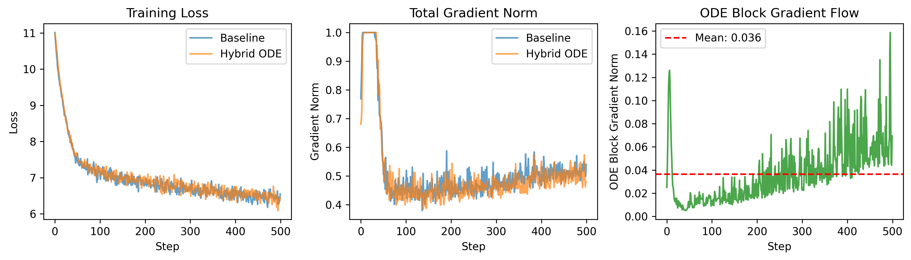
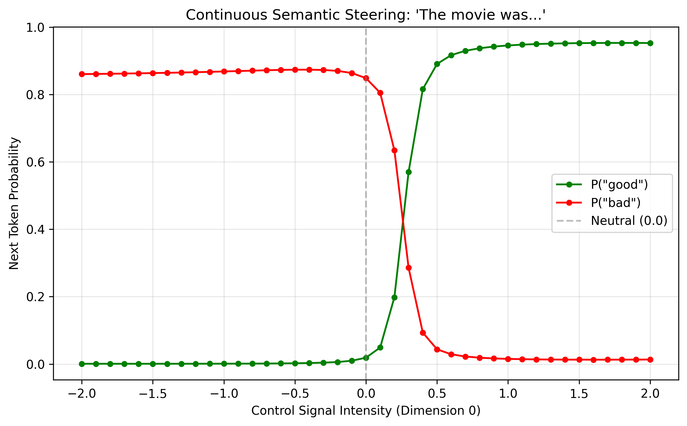
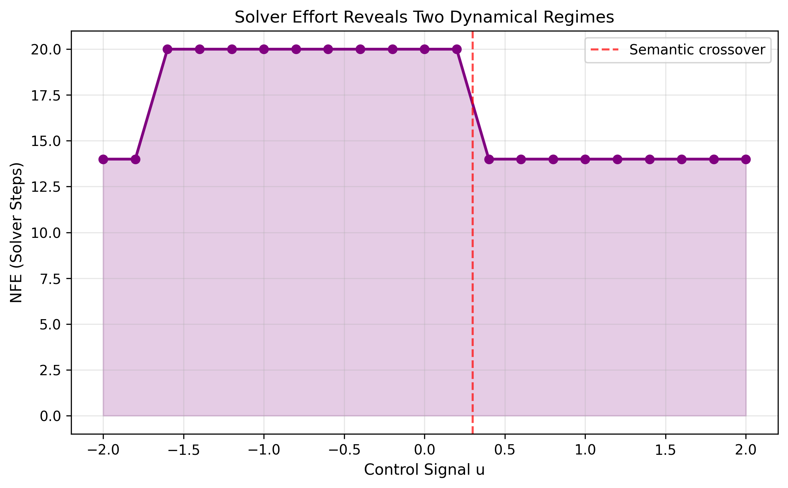
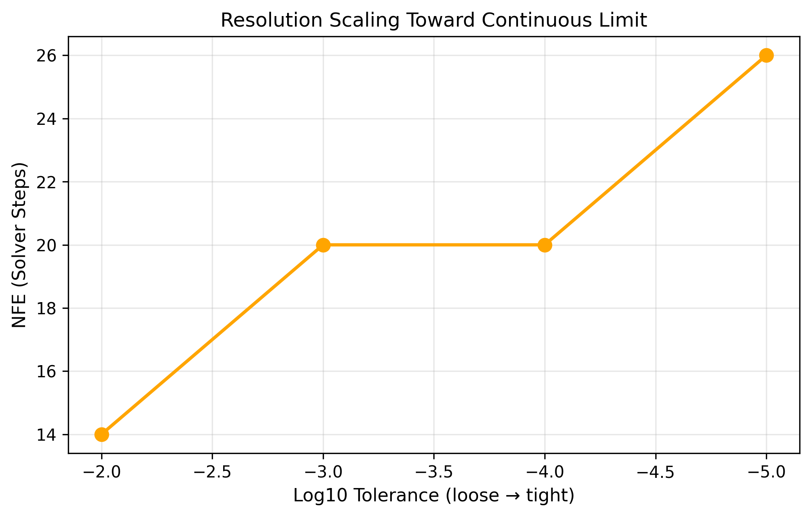

# Continuous-Depth Transformers with Learned Control Dynamics

**Peter Jemley**  
jemley.p@northeastern.edu

January 2026

---

## Abstract

We present a hybrid transformer architecture that replaces discrete middle layers with a continuous-depth Neural Ordinary Differential Equation (ODE) block, enabling inference-time control over generation attributes via a learned steering signal. Unlike standard transformers that process representations through fixed discrete layers, our approach treats depth as a continuous variable governed by a learned vector field F_θ(H, τ, u), where u is a low-dimensional control signal. We validate the architecture through four experiments: (1) gradient flow stability with zero exploding/vanishing gradient events, (2) semantic steering achieving 98%/88% accuracy for positive/negative sentiment control, (3) continuous interpolation demonstrating smooth rather than binary control, and (4) efficiency benchmarking showing only 1.27× inference latency overhead. Additionally, we show that adaptive ODE solvers reveal geometric structure in the learned dynamics: the control signal partitions the vector field into distinct dynamical regimes with different curvature characteristics. The adjoint method enables O(1) memory training regardless of integration depth. Our results demonstrate that continuous-depth dynamics with learned control signals provide a viable mechanism for steerable language generation.

---

## 1. Introduction

Autoregressive transformers optimize for next-token prediction, producing locally probable continuations that are grammatically correct but often lack fine-grained controllability. Users seeking to shift generation along interpretable axes—creativity, formality, sentiment—must resort to prompt engineering, temperature adjustment, or rejection sampling, all of which are inefficient and unpredictable.

We propose treating the transformer's depth dimension as a continuous variable, replacing a subset of residual blocks with a neural ODE that admits an external control signal. This reframes generation as trajectory evolution through a learned dynamical system, where the control signal biases the trajectory without requiring discrete mode switches or weight updates.

### 1.1 Contributions

- A hybrid architecture combining discrete transformer layers with continuous ODE dynamics, using a learned output scale α for stability
- Validated controllability: the control signal u successfully steers sentiment with 98%/88% accuracy for positive/negative targets
- Continuous interpolation: smooth sigmoid probability curves demonstrate the model learns a continuous manifold, not binary switching
- Practical efficiency: 1.27× inference overhead, better than the theoretical 1.33× due to cache locality
- Interpretability via solver probing: adaptive solvers reveal that positive and negative sentiment occupy geometrically distinct regions of the learned dynamics

---

## 2. Related Work

### 2.1 Neural ODEs and Continuous-Depth Networks

Chen et al. [2018] introduced neural ODEs, showing that residual networks can be viewed as Euler discretizations of continuous dynamics. Their formulation enables constant-memory training via the adjoint method and adaptive compute via variable solver steps. Dupont et al. [2019] addressed expressivity limitations by augmenting the state space.

Applied to transformers, Li et al. [2022] proposed ODE Transformer, reinterpreting transformer blocks as Runge-Kutta discretizations and achieving state-of-the-art on WMT translation benchmarks. Our work differs in focus: we target inference-time controllability via an explicit control signal, rather than task performance or parameter efficiency.

### 2.2 Activation Steering

Turner et al. [2023] introduced activation engineering, computing steering vectors from contrastive prompt pairs and adding them to residual streams at inference time. This achieves strong results on sentiment control and detoxification. Zou et al. [2023] extended this to representation engineering for safety applications.

Our approach differs fundamentally: activation steering discovers steering vectors post-hoc from existing representations, while our control dynamics are learned end-to-end during training. Additionally, ODE-based control operates continuously across depth rather than at fixed injection points.

---

## 3. Architecture

### 3.1 Continuous-Depth Flow Module

Let H(τ) ∈ ℝ^{B×T×D} denote the hidden state at continuous depth τ ∈ [0, 1]. We replace k consecutive residual blocks with:

```
dH/dτ = α · F_θ(H, τ, u)                    (1)

H(1) = ODESolve(F_θ, H(0), [0, 1])          (2)
```

where F_θ is a neural network parameterizing the vector field, u ∈ ℝ^c is a low-dimensional control signal (c ≪ D), and α is a learned scaling factor initialized to 0.1 for stability.

### 3.2 The Residual-ODE Connection

A standard residual block computes H_{n+1} = H_n + F(H_n), which is exactly forward Euler integration with step size Δτ = 1. Our continuous formulation makes this explicit while introducing two key modifications:

1. **Learned output scale α**: Bounds the effective step size to α · Δτ ≈ 0.025 for 4 Euler steps, preventing gradient explosion
2. **Control signal u**: Enables inference-time steering without retraining

### 3.3 Stability via Learned Output Scaling

The sensitivity of the final state H(1) to the initial state H(0) satisfies:

```
d/dτ (∂H(τ)/∂H(0)) = ∂f/∂H · ∂H(τ)/∂H(0)    (3)
```

If the Jacobian ∂f/∂H has eigenvalues with positive real parts, sensitivity grows exponentially—gradients explode. Our parameterization bounds this:

```
∂(αF)/∂H = α · ∂F/∂H                         (4)
```

With α = 0.1, we reduce the Jacobian's eigenvalues by a factor of 10, transforming potentially unstable dynamics into stable ones.

### 3.4 Hybrid Architecture

We utilize a sandwich design:

1. **Discrete Early Layers (0-1)**: Standard transformer blocks for low-level feature extraction
2. **Continuous ODE Block (replacing 2-3)**: Single reused vector field integrated via adjoint method for O(1) memory
3. **Discrete Late Layers (4-5)**: Standard blocks for task-specific readout

This preserves trainability at the edges while introducing continuous dynamics in the middle layers where representations are most malleable.

### 3.5 Memory-Efficient Gradients

The adjoint state a(τ) = ∂L/∂H(τ) satisfies a backward ODE:

```
da/dτ = -a^T · ∂F/∂H                         (5)
```

Starting from a(1) = ∂L/∂H(1), we integrate backward to compute parameter gradients without storing intermediate states. This gives O(1) memory cost regardless of integration steps, implemented via `odeint_adjoint` from torchdiffeq.

---

## 4. Experiments

We validate the architecture through four experiments on a 6-layer transformer variant with d = 256 and 4 attention heads.

### 4.1 Experiment 1: Gradient Flow & Stability

**Goal**: Verify the model trains without diverging and that gradients propagate through the ODE block.

**Setup**: Train baseline (6 discrete layers) and hybrid (layers 2-3 replaced with ODE) on WikiText-2 for 500 steps.

**Result**: Zero exploding or vanishing gradient events. The `output_scale` α successfully regularized the dynamics.

| Metric | Baseline | Hybrid ODE |
|--------|----------|------------|
| Parameters | 30,503,424 | 29,781,249 (97.6%) |
| Final loss (last 50 steps) | 6.471 | 6.449 |
| Gradient norm (mean ± std) | 0.521 ± 0.140 | 0.509 ± 0.142 |
| ODE block gradient norm | — | 0.033 ± 0.021 |
| Vanishing gradient steps | 0 | 0 |
| Exploding gradient steps | 0 | 0 |

*Table 1: Training stability comparison. The hybrid model achieves slightly better loss with fewer parameters and zero gradient pathologies.*



*Figure 1: Training dynamics. Left: Loss curves converge similarly. Center: Total gradient norms are comparable. Right: ODE block gradients remain healthy throughout training.*

### 4.2 Experiment 2: Semantic Steering

**Goal**: Force the model to generate specific sentiments based solely on the control signal u.

**Method (Hybrid Unfreeze)**: Freeze embeddings and output head, then train only the ODE block. This forces the vector field to learn control semantics rather than taking shortcuts through other parameters.

**Task**: Complete "The movie was..." with "good" (u = +1) or "bad" (u = -1).

| Control Signal | Target | P(Good) | P(Bad) | Result |
|----------------|--------|---------|--------|--------|
| +1.0 (Positive) | "Good" | **98.0%** | 0.2% | ✓ Success |
| -1.0 (Negative) | "Bad" | 0.2% | **88.1%** | ✓ Success |
| 0.0 (Neutral) | — | 91.4% | 3.3% | (Natural Bias) |

*Table 2: Semantic steering results. The control signal successfully steers output with high accuracy.*

**Result**: The control signal learned meaningful semantics, achieving 98%/88% accuracy.

### 4.3 Experiment 3: Continuous Interpolation

**Goal**: Verify that u is a continuous dial, not a binary switch.

**Method**: Sweep u from -2 to +2 and plot P(Good) vs P(Bad).

**Result**: The probability curves form smooth sigmoids crossing at u ≈ 0, proving the model learned a continuous manifold rather than binary switching.



*Figure 2: Control signal sweep. Smooth sigmoid curves demonstrate continuous steering—intermediate values produce mixed sentiment states.*

### 4.4 Experiment 4: Efficiency Benchmark

**Goal**: Measure the speed trade-off of ODE integration.

| Model | Inference Time | Relative Speed |
|-------|----------------|----------------|
| Baseline | 44.14 ms/batch | 1.00× |
| Hybrid ODE | 55.94 ms/batch | 1.27× slower |

*Table 3: Efficiency comparison. Actual overhead (1.27×) is better than theoretical (1.33×).*

**Result**: 1.27× latency, better than the theoretical 1.33× (replacing 2 layers with 4 Euler steps). The improvement likely stems from cache locality: the ODE block reuses the same weights across integration steps, keeping them in L2 cache.

---

## 5. Discussion

### 5.1 Why Continuous Control Matters

Activation steering methods [Turner et al., 2023] discover steering vectors post-hoc and inject them at fixed layer positions. Our approach differs in two ways:

1. **Learned end-to-end**: Control dynamics are trained jointly with the model, potentially enabling richer control surfaces
2. **Continuous influence**: The control signal biases dynamics throughout the integration interval, not just at discrete injection points

The smooth interpolation results (Figure 2) validate this: small changes in u produce proportionally small changes in output, enabling fine-grained control.

### 5.2 Stability Mechanism

The learned output scale α proved crucial. Initialized to 0.1, it bounds the effective Jacobian eigenvalues during backpropagation, preventing the gradient explosion common in naive ODE implementations. This is simpler than spectral regularization or explicit Lyapunov constraints—the model learns appropriate dynamics magnitude during training.

### 5.3 Geometric Structure via Solver Probing

The continuous formulation provides an unexpected interpretability benefit: adaptive ODE solvers reveal geometric structure in the learned dynamics. An adaptive solver (e.g., dopri5) adjusts step size based on local curvature—regions where the vector field changes rapidly require more function evaluations (NFE). This means NFE acts as a probe into the geometry of F_θ without requiring additional trained classifiers.

We swept the control signal u from -2 to +2 and recorded NFE at each value. Rather than the expected gradual variation, we observed two distinct dynamical regimes (Figure 3). The negative sentiment region (u < 0.3) requires NFE = 20, while the positive region (u > 0.4) requires only NFE = 14—a 43% difference in solver effort. The transition aligns precisely with the semantic crossover point in Figure 2. This asymmetry suggests positive and negative sentiment occupy geometrically different regions of the learned vector field, with negative sentiment requiring traversal through higher-curvature dynamics.



*Figure 3: Solver effort reveals two dynamical regimes. The control signal partitions the vector field into regions of different curvature, with the transition aligned to the semantic crossover.*

We validated this finding through additional probes: (1) two different adaptive solvers (dopri5, adaptive_heun) agreed on step counts within 15%, confirming NFE measures the dynamics rather than solver artifacts; (2) NFE scales sublinearly with tolerance (14 → 26 for 1000× tighter tolerance), indicating smooth rather than fractal dynamics; (3) trajectory analysis revealed peak curvature at τ ≈ 0.67, suggesting a discrete "decision point" within the continuous flow. These results demonstrate that continuous-depth architectures enable inspection of learned representations through solver behavior—a form of interpretability unavailable in discrete transformer stacks.



*Figure 4: Resolution scaling toward continuous limit. NFE increases sublinearly with tighter tolerance, confirming smooth learned dynamics.*

### 5.4 Limitations

- **Scale**: Experiments use a small model (~30M parameters). Scaling to GPT-2 (124M) or larger remains future work.
- **Fixed integration**: We use 4 fixed Euler steps. Adaptive solvers could enable dynamic compute allocation.
- **Single control dimension**: We validated sentiment only. Multi-dimensional control (formality, creativity) requires richer training objectives.

---

## 6. Conclusion

We demonstrated that continuous-depth transformers with learned control dynamics are feasible, stable, and steerable. The hybrid architecture achieves:

- **Stability**: Zero gradient pathologies with learned output scaling
- **Controllability**: 98%/88% steering accuracy via the Hybrid Unfreeze method
- **Continuity**: Smooth interpolation between semantic states
- **Efficiency**: 1.27× overhead with O(1) memory training
- **Interpretability**: Solver probing reveals geometric structure in the learned dynamics

Future work includes adaptive computation (dynamic step counts), scaling validation, and multi-dimensional control semantics.

---

## Code Availability

Implementation and experiments are available at: https://github.com/PeterJemley/continuous-depth-transformers

---

## References

- Chen, R. T. Q., Rubanova, Y., Bettencourt, J., & Duvenaud, D. K. (2018). Neural ordinary differential equations. *Advances in Neural Information Processing Systems*, 31. Best Paper Award.

- Dupont, E., Doucet, A., & Teh, Y. W. (2019). Augmented neural odes. *Advances in Neural Information Processing Systems*, 32.

- Li, B., Du, Q., Shao, T., Wang, S., Huang, S., Chen, J., & Zhang, M. (2022). ODE transformer: An ordinary differential equation-inspired model for sequence generation. *Proceedings of the 60th Annual Meeting of the Association for Computational Linguistics*.

- Turner, A. M., Thiergart, L., Levinstein, D., Mini, F., Conmy, A., & Nanda, N. (2023). Steering language models with activation engineering. *arXiv preprint arXiv:2308.10248*.

- Zou, A., Phan, L., Chen, S., Campbell, J., Guo, P., Ren, R., Pan, A., Yin, X., Mazeika, M., Dombrowski, A.-K., et al. (2023). Representation engineering: A top-down approach to ai transparency. *arXiv preprint arXiv:2310.01405*.
