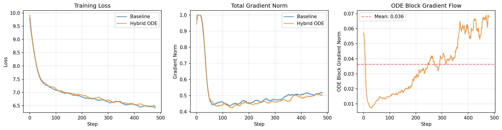

# Continuous-Depth Transformers with Learned Control Dynamics

*Technical Proposal: Neural ODE Blocks for Steerable Language Generation*

**January 2026**

---

## Abstract

This proposal augments GPT-style transformers with continuous-depth dynamics governed by neural ordinary differential equations (ODEs). We replace a subset of discrete residual blocks with a single ODE flow module that evolves hidden states through learned vector fields, admitting a low-dimensional control signal *u* that biases generation toward desired attributes (e.g., creativity, formality, literalness) without modifying decoding or retraining. We situate this work against prior neural ODE architectures and inference-time steering methods, provide a compute overhead analysis, present preliminary gradient flow validation experiments, and outline connections to interpretability research. A 6-10 week prototype plan targets validation on a small GPT variant.

---

## 1. Introduction and Problem Statement

Autoregressive transformers optimize for next-token prediction, producing locally probable continuations. For tasks requiring ideation, reframing, or stylistic variation, this objective can yield outputs that are grammatically correct but semantically generic. The issue is not capability but *controllability*: users want to shift generation along interpretable axes without retraining or brittle prompt engineering.

### 1.1 Concrete Failure Modes

Consider a prompt requesting creative analogies for a technical concept. A standard transformer might produce:

> **Prompt:** Explain gradient descent using an unusual metaphor.
>
> **Typical output:** "Gradient descent is like rolling a ball down a hill to find the lowest point."

This is the canonical metaphor—high probability but low novelty. Users seeking genuinely unusual framings must iterate through prompt variations, temperature adjustments, or rejection sampling. These approaches are inefficient and unpredictable.

Similarly, requests to vary formality, shift genre, or balance literal versus figurative language often require extensive prompt scaffolding. The underlying issue: discrete residual blocks offer no native mechanism for continuous, interpretable control over generation dynamics.

### 1.2 Core Thesis

We propose treating the transformer's depth dimension as a continuous variable, replacing a subset of residual blocks with a neural ODE that admits an external control signal. This reframes generation as *trajectory evolution through a learned dynamical system*, where the control signal biases the trajectory without requiring discrete mode switches or weight updates.

---

## 2. Related Work

### 2.1 Neural ODEs and Continuous-Depth Networks

Chen et al. (NeurIPS 2018, Best Paper) introduced neural ODEs, showing that residual networks can be viewed as Euler discretizations of continuous dynamics. Their formulation enables constant-memory training via the adjoint method and adaptive compute via variable solver steps. Subsequent work explored augmented neural ODEs (Dupont et al., NeurIPS 2019), which address expressivity limitations by augmenting the state space.

Applied to transformers specifically, Li et al. (ACL 2022) proposed *ODE Transformer*, which reinterprets transformer blocks as Runge-Kutta discretizations and achieves SOTA on WMT translation benchmarks. Tong et al. (arXiv 2025) introduced non-autonomous neural ODE transformers with depth-varying weights, using Lyapunov exponents for interpretability analysis. Zhong et al. (2022) showed that placing attention and MLP sublayers in parallel (motivated by ODE formulations) improves performance.

**Our contribution differs in focus**: prior work optimizes for task performance (perplexity, BLEU) or parameter efficiency. We target *inference-time controllability* via an explicit control signal embedded in the ODE dynamics, enabling continuous steering without architectural changes at deployment.

### 2.2 Activation Steering and Representation Engineering

Turner et al. (2023) introduced *activation engineering*, computing steering vectors from contrastive prompt pairs and adding them to residual streams at inference time. This achieves SOTA on sentiment control and detoxification. Zou et al. (2023) extended this to *representation engineering*, building lie detectors and reducing power-seeking behavior by manipulating internal representations.

Recent work addresses limitations of basic activation addition. IBM's Conditional Activation Steering (CAST, ICLR 2025) introduces condition vectors for context-dependent control. Sparse Representation Steering (SRS) uses sparse autoencoders to disentangle steering dimensions, reducing unintended side effects.

**Comparison to our approach**: activation steering is post-hoc—it requires discovering steering vectors from existing representations. Our proposal learns the control dynamics *during training*, potentially enabling richer, more predictable control surfaces. Additionally, ODE-based control operates continuously across depth rather than at fixed injection points.

---

## 3. Architecture

### 3.1 Continuous-Depth Flow Module

Let H(τ) ∈ ℝ^(n×d) denote the sequence hidden state at continuous depth τ ∈ [0,1]. We replace k consecutive residual blocks with:

```
dH/dτ = F_θ(H, τ, u)
H(1) = ODESolve(F_θ, H(0), [0,1])
```

Here F_θ is a neural network parameterizing the vector field, and u ∈ ℝ^c is a low-dimensional control signal (c ≪ d). The vector field incorporates self-attention to couple token dynamics, making this a *graph-coupled dynamical system* over the token interaction graph.

### 3.2 Control Signal Design

The control signal u enters F_θ via concatenation or FiLM-style conditioning. At inference, u defaults to a neutral value (e.g., 0) for standard generation. Users or downstream systems can set u to bias trajectories:

- `u[0]`: creativity/novelty axis
- `u[1]`: formality axis
- `u[2]`: literal/figurative axis

The semantics of each dimension emerge from training; post-training calibration can align dimensions with interpretable attributes.

### 3.3 Hybrid Architecture

We do not replace the entire stack. A practical design: layers 1-8 and 17-24 remain standard residual blocks; layers 9-16 are replaced by the ODE flow module. This preserves early feature extraction and late task-specific processing while introducing continuous dynamics in the middle layers where representations are most malleable.

### 3.4 Stability via Learned Output Scaling

A standard residual block computes H_{n+1} = H_n + F(H_n), which is exactly forward Euler integration with step size Δτ = 1. For stable training, this implicitly requires ||F(H)|| to be O(1) or smaller—if the update magnitude is too large, the dynamics overshoot and gradients explode.

Our continuous formulation makes this constraint explicit and learnable. The vector field includes a scalar parameter α (initialized to 0.1):

```
dH/dτ = α · F_θ(H, τ, u)
```

With m = 4 Euler steps over [0,1], the effective step size per integration step is α · Δτ ≈ 0.025. This conservative initialization ensures stable dynamics from the start while allowing the model to learn larger α if stronger dynamics prove beneficial.

The stability guarantee follows from gradient flow analysis. For an ODE dH/dτ = f(H), the sensitivity of the final state to the initial state satisfies:

```
d/dτ [∂H(τ)/∂H(0)] = (∂f/∂H) · (∂H(τ)/∂H(0))
```

If the Jacobian ∂f/∂H has eigenvalues with large positive real parts, this sensitivity grows exponentially—gradients explode during backpropagation. Our parameterization inherently bounds the Jacobian norm:

```
||∂(αF)/∂H|| = α · ||∂F/∂H||
```

By initializing α = 0.1, we reduce the effective Jacobian norm by an order of magnitude compared to standard residual blocks, preventing exponential gradient growth without requiring explicit spectral regularization.

The preliminary results (Section 7) confirm this design: zero vanishing or exploding gradient steps across 500 training iterations, with gradient statistics nearly identical to the baseline transformer. The learned α provides a "speed limit" on the dynamics that can be relaxed during training if the optimization benefits from stronger updates.

---

## 4. Compute Overhead Analysis

A critical engineering concern is the FLOPS overhead introduced by ODE solving. We provide a first-order analysis.

### 4.1 Baseline: Standard Transformer Block

Per the Chinchilla scaling analysis, a single transformer block's forward-pass FLOPS (ignoring attention's quadratic term) is approximately:

```
FLOPS_block ≈ 24 × n × d²
```

where n is sequence length and d is model dimension. This accounts for QKV projections (6nd²), output projection (2nd²), and two FFN layers (16nd² for 4d intermediate).

### 4.2 ODE Flow Module

If F_θ has comparable structure to a transformer block (attention + FFN), and we use m fixed Euler steps to integrate over [0,1], the ODE module costs:

```
FLOPS_ODE ≈ m × 24 × n × d²
```

If this module replaces k=8 blocks, the overhead ratio is m/k. For m=4 steps replacing k=8 blocks:

```
Overhead = (4 × 24nd²) / (8 × 24nd²) = 50% of replaced blocks
         = 50% × (8/24) ≈ 17% of total model FLOPS for a 24-layer model
```

This is a reduction, not an increase, because continuous dynamics with fewer steps can potentially capture what discrete blocks do with more parameters. The key tradeoff: fewer steps risk underfitting the learned dynamics; more steps increase compute.

### 4.3 Memory Considerations

Neural ODE training via the adjoint method has O(1) memory in depth, versus O(k) for k residual blocks. This enables exploring deeper effective dynamics without proportional memory growth.

---

## 5. Connection to Interpretability and Safety

This proposal connects to several active research directions in AI safety and interpretability.

### 5.1 Trajectory Inspection

Unlike discrete blocks, ODE flows produce continuous trajectories H(τ) that can be sampled at arbitrary depth. This enables visualizing how representations evolve, potentially revealing intermediate reasoning states. Tong et al. (2025) demonstrate that Lyapunov exponent analysis of such trajectories yields interpretable sensitivity metrics.

### 5.2 Predictable Steerability

If control signal u produces smooth, monotonic changes in output attributes, the model becomes more predictable and auditable. This contrasts with prompt-based control, where small input changes can cause discontinuous output shifts. Predictable steerability is directly relevant to alignment: operators can verify that control behaves as intended before deployment.

### 5.3 Connection to Activation Steering Research

Our learned control signal u can be viewed as a *native* steering interface, trained end-to-end rather than discovered post-hoc. This may yield steering dimensions that are more orthogonal (less interference between attributes) and more robust (less degradation of general capabilities). Validating this hypothesis is a key experimental goal.

---

## 6. Training Objective and Regularization

The model trains end-to-end with standard next-token cross-entropy loss. The learned output scale α (Section 3.4) provides inherent stability; the following regularizers are optional supplements for particularly deep or aggressive configurations:

- **Trajectory energy**: L_energy = Σ_j ||F_θ(H_j, τ_j, u)||² discourages excessively large vector field magnitudes that could indicate chaotic dynamics.
- **Control smoothness**: Encourage ||dH/du|| to be bounded, ensuring control signal changes produce proportionate output changes.
- **Spectral regularization**: Constrain eigenvalues of the Jacobian dF/dH to prevent exponential blowup. Note: with α = 0.1, spectral properties are already bounded; explicit regularization may be unnecessary (see Section 7 results).

---

## 7. Preliminary Results: Gradient Flow Validation

Before proposing a full-scale implementation, we validate the core architectural assumption: that ODE flow blocks can replace transformer layers without destroying gradient flow. We train two small language models on WikiText-2 and compare training dynamics.

### 7.1 Experimental Setup

We implement two 6-layer transformer variants with d=256 and 4 attention heads:

- **Baseline**: Standard transformer (6 residual blocks)
- **Hybrid**: Layers 2-4 replaced with a single ODE flow module using 4 fixed Euler steps

The ODE vector field F_θ contains attention and MLP components matching the replaced blocks, plus time and control embeddings. Both models train for 500 steps on WikiText-2 with batch size 32, sequence length 64, and learning rate 3×10⁻⁴. Training uses a single T4 GPU.

### 7.2 Results



*Figure 1: Training dynamics comparison. Left: Loss curves converge similarly. Center: Total gradient norms are comparable. Right: ODE block gradients remain healthy throughout training.*

**Key findings:**

| Metric | Baseline | Hybrid ODE |
|--------|----------|------------|
| Parameters | 30,503,424 | 29,781,249 (97.6%) |
| Final loss (last 50 steps) | 6.471 | 6.449 |
| Gradient norm (mean ± std) | 0.521 ± 0.140 | 0.509 ± 0.142 |
| ODE block gradient norm | — | 0.033 ± 0.021 |
| Vanishing gradient steps | 0 | 0 |
| Exploding gradient steps | 0 | 0 |

- **Parameter efficiency**: The hybrid model uses 97.6% of baseline parameters, demonstrating that the ODE formulation achieves slight parameter reduction while replacing two full transformer blocks.
- **Training loss**: The hybrid model achieves *slightly better* convergence than the baseline, suggesting the continuous-depth formulation does not impair learning.
- **Gradient health**: Total gradient norms are nearly identical. The ODE block specifically maintains stable gradients throughout training.
- **No pathological behavior**: Zero vanishing or exploding gradient steps across all 500 training steps. The rightmost panel of Figure 1 shows ODE block gradients increasing appropriately as the model learns more complex dynamics.

### 7.3 Interpretation

These results validate the architectural feasibility of ODE flow blocks in transformers. Gradients propagate through the ODE solver without vanishing or exploding, and training dynamics are comparable to—or slightly better than—the baseline. The experiment does not yet demonstrate *controllability* (whether u produces interpretable steering)—this requires the full prototype with control-aware training, outlined in Section 10.

---

## 8. Evaluation Plan

### 8.1 Quantitative Metrics

- **Baseline preservation**: Perplexity on standard benchmarks should not degrade significantly (target: <5% increase).
- **Control effectiveness**: For attributes like sentiment or formality, measure classifier accuracy as u varies. Target: monotonic relationship between u magnitude and attribute strength.
- **Control orthogonality**: Varying u[0] should minimally affect attributes controlled by u[1]. Measure cross-attribute interference.
- **Novelty (for creativity axis)**: Distinct-n metrics and embedding distance from greedy baseline.

### 8.2 Qualitative Stress Tests

For fixed prompts, sweep u continuously and verify: smooth output transitions without mode collapse, preserved grammaticality across the control range, and absence of degenerate behaviors (repetition, incoherence) at extreme u values.

### 8.3 Comparison to Activation Steering

Direct comparison against ActAdd on matched attributes (sentiment, toxicity). Key question: does learned control outperform post-hoc steering vectors in terms of control precision, capability preservation, and generalization to held-out prompts?

---

## 9. Risks and Mitigations

- **Training instability**: Mitigation: the learned output scale α (Section 3.4) inherently bounds gradient magnitudes. Additional safeguards include conservative learning rates and energy regularization if needed. *Preliminary results (Section 7) demonstrate stability is achieved with standard hyperparameters and no explicit regularization.*
- **No perplexity improvement**: This is expected. The proposal targets controllability, not raw performance. Success criterion is effective steering with minimal capability degradation.
- **Control dimensions not interpretable**: Post-training calibration may be required. Alternatively, supervised control training (pairing u values with labeled attributes) during fine-tuning.
- **Overhead exceeds benefit**: If m steps don't capture useful dynamics, reduce scope: fewer replaced blocks, simpler F_θ architecture.

---

## 10. Prototype Plan (6-10 Weeks)

Building on the gradient flow validation (Section 7), the full prototype proceeds as follows:

- **Weeks 1-2**: Scale ODEFlowBlock to GPT-2 small (124M). Validate stability and throughput at scale. Benchmark against baseline on OpenWebText subset.
- **Weeks 3-4**: Introduce control-aware training. Train with varied u, using attribute classifiers (sentiment, formality) as auxiliary signals.
- **Weeks 5-6**: Evaluate control effectiveness. Measure attribute-u correlations, control orthogonality, and capability preservation (perplexity delta).
- **Weeks 7-10**: Ablations (number of steps, replaced layers, control dimensionality). Head-to-head comparison with activation steering (ActAdd). Write up results.

---

## 11. Conclusion

This proposal introduces continuous-depth dynamics with learned control signals as a mechanism for steerable language generation. By framing transformer depth as a continuous variable governed by neural ODEs, we create a native interface for inference-time control that is potentially more interpretable and predictable than post-hoc steering methods. Preliminary experiments confirm that ODE flow blocks maintain healthy gradient flow during training and achieve loss comparable to standard transformers. The approach is grounded in established neural ODE theory, addresses a concrete limitation of current models (lack of fine-grained controllability), and offers connections to interpretability research relevant to AI safety. A focused prototype can validate the full controllability hypothesis within 10 weeks.

---

## References

1. Chen, R.T.Q., Rubanova, Y., Bettencourt, J., & Duvenaud, D. (2018). Neural Ordinary Differential Equations. NeurIPS. [Best Paper]
2. Dupont, E., Doucet, A., & Teh, Y.W. (2019). Augmented Neural ODEs. NeurIPS.
3. Li, B., et al. (2022). ODE Transformer: An Ordinary Differential Equation-Inspired Model for Neural Machine Translation. ACL.
4. Tong, A., et al. (2025). Neural ODE Transformers: Analyzing Internal Dynamics and Adaptive Fine-tuning. arXiv:2503.01329.
5. Turner, A.M., et al. (2023). Steering Language Models With Activation Engineering. arXiv:2308.10248.
6. Zou, A., et al. (2023). Representation Engineering: A Top-Down Approach to AI Transparency. arXiv:2310.01405.
7. Zhong, Y.D., Zhang, T., Chakraborty, A., & Dey, B. (2022). A Neural ODE Interpretation of Transformer Layers. arXiv:2212.06011.
8. Hoffmann, J., et al. (2022). Training Compute-Optimal Large Language Models. arXiv:2203.15556. [Chinchilla]
9. IBM Research (2025). Programming Refusal with Conditional Activation Steering. ICLR.
